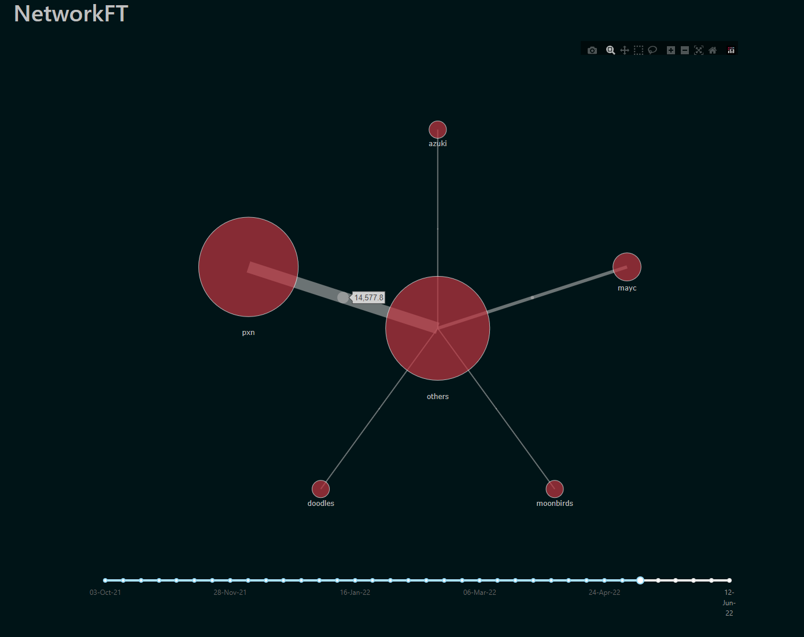
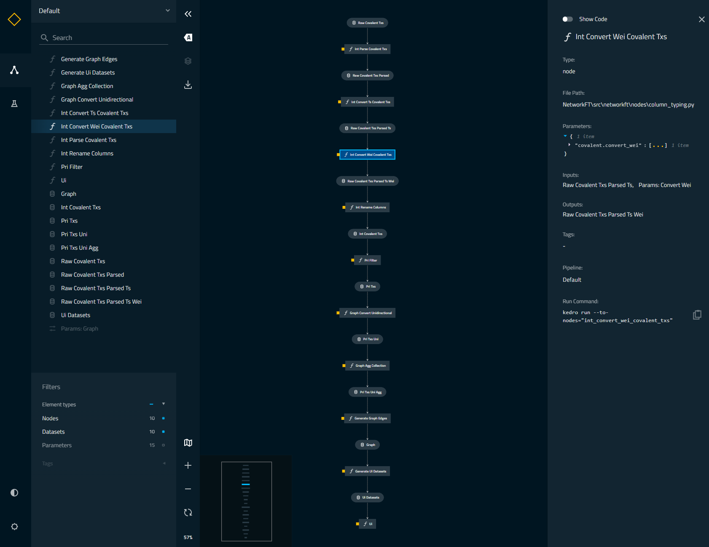

# NetworkFT

## Contents
1. [Overview](#Overview)
2. [Quickstart](#Quickstart)
3. [Adapting NetworkFT](#Adapting NetworkFT)
4. [Kedro](#Kedro)

## Overview

NetworkFT is a platform for visualising the flow of liquidity between NFT projects. 
An example is shown below.



The real value of the project, however, lies in the framework used to develop the 
platform. Under the hood, the library contains a collection of modules for web3 
analytics use cases. Ultimately, it is a data pipelining asset for web3 data 
intended to be used for:

- Integrating web3 data with existing analytics infrastructure
- Setting up back-end for web3 analytics / AI applications

but is by no means limited to these situations. The modular nature of this asset 
enables it to be used in a flexible range of scenarios.

NetworkFT has been developed using Kedro, an opened-sourced Python framework 
for creating reproducible, maintainable and modular data science code. Take a look at 
the [Kedro documentation](https://kedro.readthedocs.io) for more information.

## Quickstart

## Adapting NetworkFT

## Kedro

### How to install dependencies

Pre-requisites:
  - Python 3 version <=3.9
  - Kedro


```
pip install -r src/requirements.txt
```
Note: there are some issues with resolving version conflict of the requirement 
packages, this step might take a while.

### How to run your Kedro pipeline

You can run a Kedro pipeline with:

```
kedro run --pipeline PIPELINE_NAME
```

There are currently 3 pipelines: 

1. covalent - prepares a liquidity graph from the raw data of transactions 
   downloaded from the covalent API
2. ui - creates the datasets required for the dashboard, and spins up a Flask server 
   to display the dashboard
3. default - runs both the above pipeline

## How to visualise your Kedro pipelines

`kedro-viz` is a visualisation tool for kedro pipelines. You can read more about it 
at the [Kedro viz repository](https://github.com/kedro-org/kedro-viz). To start it, run:

```
kedro viz
```



## How to test your Kedro project

Have a look at the file `src/tests/test_run.py` for instructions on how to write your tests. You can run your tests as follows:

```
kedro test
```

To configure the coverage threshold, go to the `.coveragerc` file.

## How to work with Kedro and notebooks

> Note: Using `kedro jupyter` or `kedro ipython` to run your notebook provides these variables in scope: `context`, `catalog`, and `startup_error`.
>
> Jupyter, JupyterLab, and IPython are already included in the project requirements by default, so once you have run `pip install -r src/requirements.txt` you will not need to take any extra steps before you use them.

### Jupyter
To use Jupyter notebooks in your Kedro project, you need to install Jupyter:

```
pip install jupyter
```

After installing Jupyter, you can start a local notebook server:

```
kedro jupyter notebook
```

### JupyterLab
To use JupyterLab, you need to install it:

```
pip install jupyterlab
```

You can also start JupyterLab:

```
kedro jupyter lab
```

### IPython
And if you want to run an IPython session:

```
kedro ipython
```

### How to convert notebook cells to nodes in a Kedro project
You can move notebook code over into a Kedro project structure using a mixture of [cell tagging](https://jupyter-notebook.readthedocs.io/en/stable/changelog.html#release-5-0-0) and Kedro CLI commands.

By adding the `node` tag to a cell and running the command below, the cell's source code will be copied over to a Python file within `src/<package_name>/nodes/`:

```
kedro jupyter convert <filepath_to_my_notebook>
```
> *Note:* The name of the Python file matches the name of the original notebook.

Alternatively, you may want to transform all your notebooks in one go. Run the following command to convert all notebook files found in the project root directory and under any of its sub-folders:

```
kedro jupyter convert --all
```

### How to ignore notebook output cells in `git`
To automatically strip out all output cell contents before committing to `git`, you can run `kedro activate-nbstripout`. This will add a hook in `.git/config` which will run `nbstripout` before anything is committed to `git`.

> *Note:* Your output cells will be retained locally.

## Package your Kedro project

[Further information about building project documentation and packaging your project](https://kedro.readthedocs.io/en/stable/tutorial/package_a_project.html)
